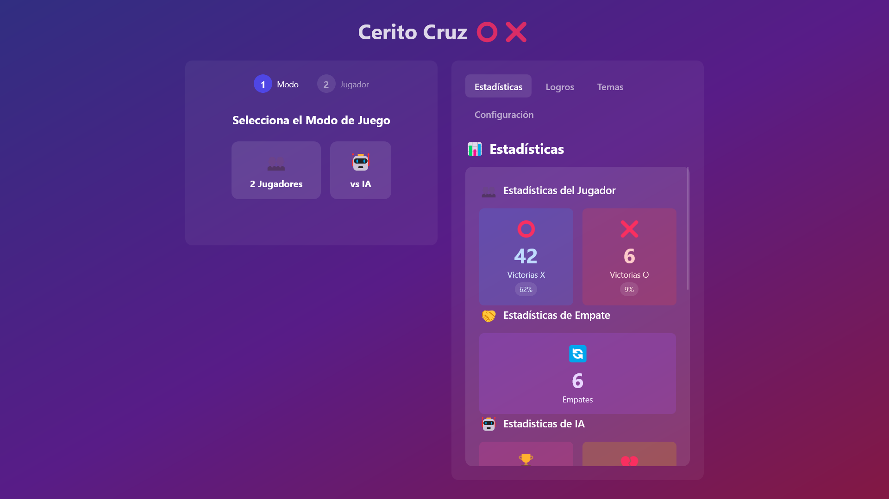

# Cerito Cruz Vue 3 🎮

<div align="center">



[![Made with Vue][vue-badge]][vue-url]
[![TypeScript][ts-badge]][ts-url]
[![Tailwind CSS][tailwind-badge]][tailwind-url]
[![License][license-badge]][license-url]
[![PRs Welcome][prs-badge]][prs-url]

_A modern, elegant, and feature-rich Tic Tac Toe game built with Vue 3 + TypeScript_

[🎮 Play Now][play-url] | [🌟 Features](#-features) | [🚀 Getting Started](#-getting-started) | [🛠️ Tech Stack](#-tech-stack)

</div>

## ✨ Features

### 🎯 Core Gameplay

- **Modern Interface**: Sleek, responsive design with smooth animations
- **Multiple Game Modes**: Play against AI or challenge a friend locally
- **AI Difficulty Levels**: Test your skills against different AI strategies
- **Theme System**: Unlock beautiful themes as you play
- **Internationalization**: Support for 7 languages
- **Statistics & Achievements**: Track your progress and earn rewards
- **Sound Effects**: Immersive audio feedback
- **Persistent Progress**: Auto-save your achievements and stats
- **Easter Eggs**: Discover hidden features and themes

### 🤖 AI Intelligence

- **Smart Decision Making**: Advanced AI using minimax algorithm
- **Adaptive Difficulty**:
  - 🌱 **Easy**: Random moves for casual play
  - ⚡ **Medium**: Mix of strategic and random moves
  - 🔥 **Hard**: Optimal moves using advanced strategy

### 🎨 Theme Collection

| Theme           | Unlock Condition       | Description             |
| --------------- | ---------------------- | ----------------------- |
| 🎨 Default      | Available              | Classic look            |
| 💫 Neon         | Win 3 games as X       | Vibrant neon aesthetics |
| 🤖 Cyberpunk    | Win 3 games as O       | Futuristic design       |
| 🌌 Galaxy       | Play 15 games          | Space-inspired visuals  |
| 🍭 Candy        | Win 5 with each player | Sweet color palette     |
| 🌅 Sunset       | Play 10 games          | Warm, gradient colors   |
| 🌿 Nature       | Get 3 draws            | Organic, earthy tones   |
| 🎮 Konami       | Secret code            | Retro gaming style      |
| 🦃 Thanksgiving | Win 5 vs AI            | Autumn festival theme   |
| 🎃 Halloween    | Win 10 vs AI           | Spooky aesthetics       |
| 🎄 Christmas    | Win 15 vs AI           | Holiday celebration     |
| 🌴 Tropical     | Win 7 in Easy          | Paradise vibes          |
| ⚔️ Medieval     | Win 7 in Medium        | Classic kingdom style   |
| 🚀 Space        | Win 7 in Hard          | Cosmic adventure        |

### 🌍 Supported Languages

- 🇺🇸 English
- 🇪🇸 Spanish
- 🇫🇷 French
- 🇮🇹 Italian
- 🇩🇪 German
- 🇵🇹 Portuguese
- 🏛️ Latin

### 🏆 Achievement System

Unlock achievements as you play:

- 🎯 **Game Mastery**
  - X Master: Win 3 games as X
  - O Master: Win 3 games as O
  - Peacemaker: Achieve 3 draws
- 👑 **Experience**
  - Veteran: Play 10 games
  - Expert: Play 15 games
  - Balanced: Win 5 with each symbol
- 🤖 **AI Challenges**
  - AI Shooter: Win 5 vs AI
  - AI Killer: Win 10 vs AI
  - AI Master: Win 15 vs AI
- 🎮 **Difficulty Conquests**
  - Easy Peasy: Win 7 in Easy mode
  - Medium Breezy: Win 7 in Medium mode
  - Hard as Hell: Win 7 in Hard mode

## 🛠️ Tech Stack

### Frontend

- ⚡ [Vue 3](https://v3.vuejs.org/) with Composition API
- 📝 [TypeScript](https://www.typescriptlang.org/)
- 🎨 [Tailwind CSS](https://tailwindcss.com/)
- 🔄 [Pinia](https://pinia.vuejs.org/) for state management
- 💾 [pinia-plugin-persistedstate](https://github.com/prazdevs/pinia-plugin-persistedstate)
- ✨ [GSAP](https://greensock.com/gsap/) for animations
- 🔊 [Howler.js](https://howlerjs.com/) for sound system
- 🌐 [Vue I18n](https://vue-i18n.intlify.dev/) for internationalization
- 🎭 [HeadlessUI](https://headlessui.dev/) for accessible components
- 🎯 [VueUse](https://vueuse.org/) for composition utilities

### Development

- ⚡ [Vite](https://vitejs.dev/) for blazing fast development
- 📦 [NPM](https://www.npmjs.com/) for package management
- 🎨 [PostCSS](https://postcss.org/) for CSS processing
- 📱 Mobile-first responsive design

## 🚀 Getting Started

### Prerequisites

- Node.js 16.0 or higher
- NPM 7.0 or higher

### Installation

```bash
# Clone the repository
git clone https://github.com/yourusername/tic-tac-toe-vue

# Navigate to project directory
cd tic-tac-toe-vue

# Install dependencies
npm install

# Start development server
npm run dev
```

### Production Build

```bash
# Build for production
npm run build

# Preview production build
npm run preview
```

## 🎮 How to Play

1. Choose your game mode (PVP or AI)
2. Select difficulty (for AI mode)
3. Pick your symbol (X or O)
4. Take turns placing your symbol
5. Get three in a row to win!
6. Unlock new themes and achievements

## 🤝 Contributing

Contributions are welcome! Please feel free to submit a Pull Request.

1. Fork the repository
2. Create your feature branch (`git checkout -b feature/AmazingFeature`)
3. Commit your changes (`git commit -m 'Add some AmazingFeature'`)
4. Push to the branch (`git push origin feature/AmazingFeature`)
5. Open a Pull Request

## 📝 License

This project is licensed under the MIT License - see the [LICENSE](LICENSE) file for details.

## 👨‍💻 Author

Created with ❤️ by [EduardoProfe666](https://eduardoprofe666.github.io) 🎩

## 🙏 Acknowledgments

- Thanks to all contributors
- Inspired by classic Tic Tac Toe games
- Built with modern web technologies

<!-- MARKDOWN LINKS & BADGES -->

[vue-badge]: https://img.shields.io/badge/Vue.js-35495E?style=for-the-badge&logo=vuedotjs&logoColor=4FC08D
[vue-url]: https://vuejs.org/
[ts-badge]: https://img.shields.io/badge/TypeScript-007ACC?style=for-the-badge&logo=typescript&logoColor=white
[ts-url]: https://www.typescriptlang.org/
[tailwind-badge]: https://img.shields.io/badge/Tailwind_CSS-38B2AC?style=for-the-badge&logo=tailwind-css&logoColor=white
[tailwind-url]: https://tailwindcss.com/
[license-badge]: https://img.shields.io/badge/License-MIT-yellow.svg?style=for-the-badge
[license-url]: https://opensource.org/licenses/MIT
[prs-badge]: https://img.shields.io/badge/PRs-welcome-brightgreen.svg?style=for-the-badge
[prs-url]: http://makeapullrequest.com
[play-url]: https://cerito-cruz.onrender.com
